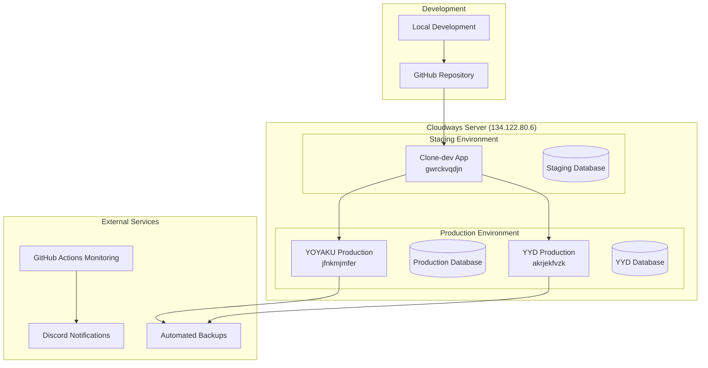
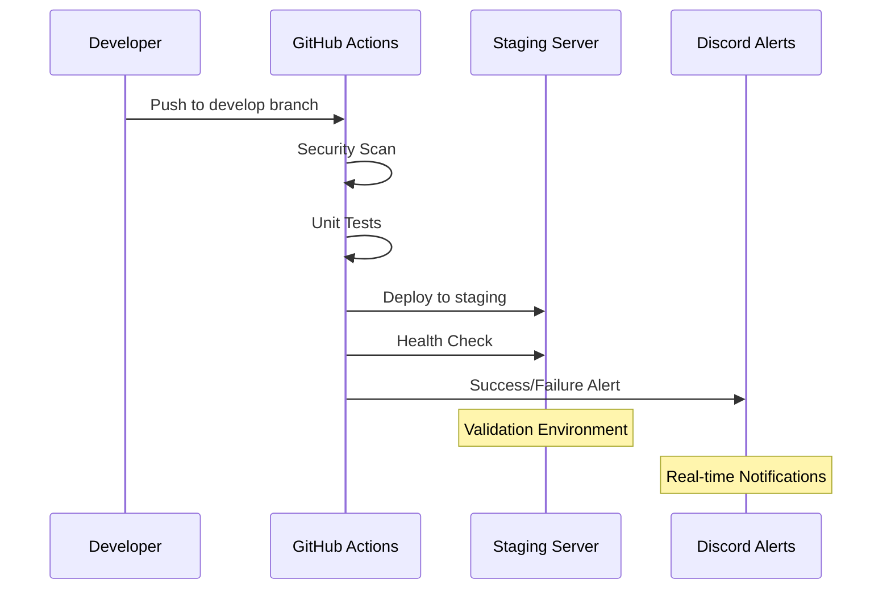
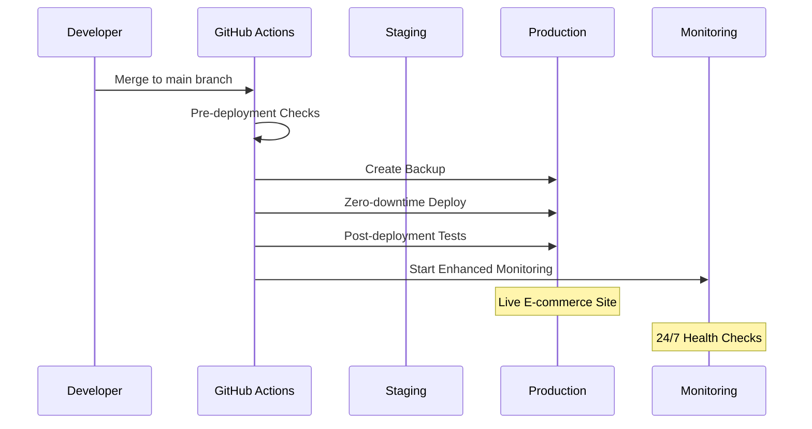
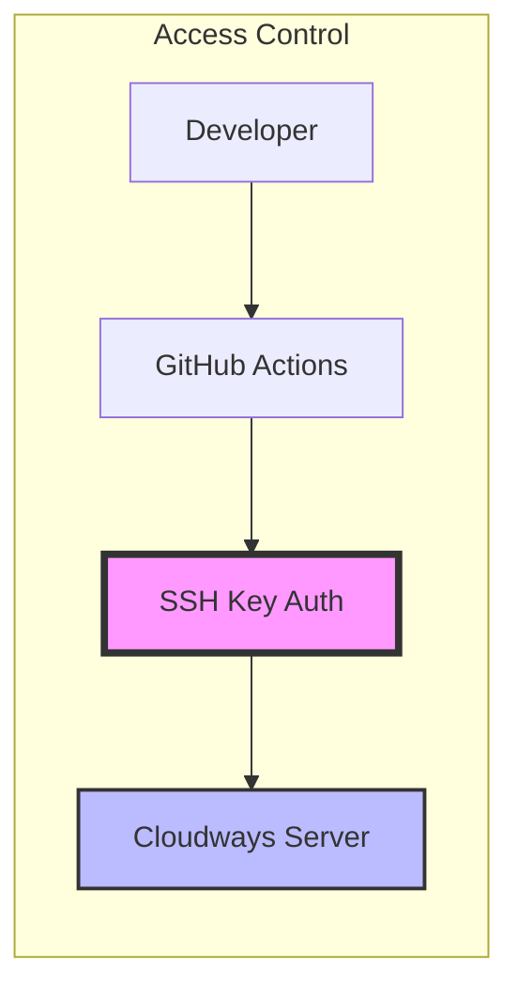
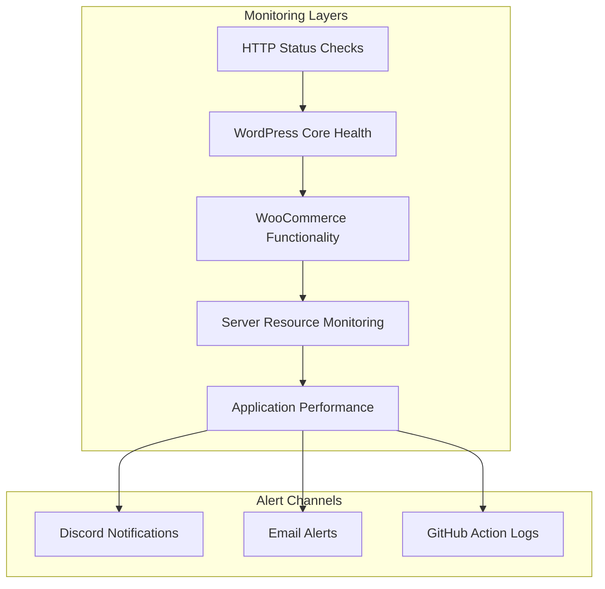

# YOYAKU CI/CD Pipeline Architecture

## 🏗️ System Overview

The YOYAKU CI/CD pipeline is designed as an enterprise-grade automation system ensuring zero-downtime deployments for e-commerce applications. It follows CLAUDE.md safety protocols and provides comprehensive monitoring and rollback capabilities.

## 🌍 Environment Architecture



## 🔄 Pipeline Flow

### 1. Development to Staging



### 2. Staging to Production



## 🏢 Infrastructure Components

### Server Infrastructure

**Cloudways Server (134.122.80.6)**
- **Provider**: DigitalOcean via Cloudways
- **SSH Access**: `master_crhmyfjcsf@134.122.80.6`
- **Authentication**: SSH Key (`~/.ssh/cloudways_rsa`)
- **Management**: Cloudways control panel

### Environment Specifications

#### Production Environment (jfnkmjmfer)
```yaml
Domain: yoyaku.io
Path: /home/master/applications/jfnkmjmfer/public_html
Database: jfnkmjmfer
PHP: 8.1
WordPress: Latest stable
WooCommerce: Latest compatible
HPOS: Enabled (67,471+ orders)
```

#### Staging Environment (gwrckvqdjn)
```yaml
Domain: woocommerce-870689-5762868.cloudwaysapps.com
Path: /home/master/applications/gwrckvqdjn/public_html
Database: gwrckvqdjn
Purpose: Development and testing
Reset: Regular (as needed)
```

#### YYD Production Environment (akrjekfvzk)
```yaml
Domain: yydistribution.fr
Path: /home/master/applications/akrjekfvzk/public_html
Database: akrjekfvzk
Purpose: YYD e-commerce operations
Orders: 5,395+ HPOS orders
```

## 🔧 Technical Stack

### Core Technologies
- **WordPress**: 5.8+ (production environments)
- **WooCommerce**: 5.0+ with HPOS support
- **PHP**: 8.1+ for optimal performance
- **MySQL**: 8.0 for database operations
- **Apache/Nginx**: Web server configuration

### CI/CD Technologies
- **GitHub Actions**: Primary automation platform
- **SSH**: Secure deployment mechanism
- **Bash Scripts**: Custom deployment logic
- **YAML**: Configuration management
- **Composer**: Dependency management
- **PHPUnit**: Testing framework

### Monitoring Stack
- **GitHub Actions**: Scheduled health checks
- **Discord API**: Real-time notifications
- **Custom Scripts**: Server metrics collection
- **WordPress CLI**: Health verification
- **Curl**: HTTP endpoint testing

## 🔐 Security Architecture

### Authentication & Access


### Security Layers

1. **GitHub Repository Security**
   - Private repository access
   - Branch protection rules
   - Required status checks
   - Merge approval requirements

2. **Deployment Security**
   - SSH key authentication only
   - No password authentication
   - Encrypted secrets management
   - Audit logging for all actions

3. **Application Security**
   - WordPress security hardening
   - Plugin vulnerability scanning
   - Code quality enforcement
   - Dangerous function detection

4. **Infrastructure Security**
   - Cloudways managed security
   - Regular security updates
   - SSL/TLS encryption
   - Firewall protection

## 📊 Monitoring Architecture

### Health Check Layers



### Monitoring Metrics

**HTTP Layer**
- Response codes (200 expected)
- Response times (<5s warning, <10s critical)
- SSL certificate validity
- DNS resolution time

**WordPress Layer**
- Core installation integrity
- Plugin activation status
- Database connectivity
- Admin panel accessibility

**WooCommerce Layer**
- Checkout page functionality
- Shop page accessibility
- Order processing capability
- Payment gateway status

**Server Layer**
- CPU load average
- Memory utilization
- Disk space usage
- PHP process count

**Business Layer**
- Transaction completion rates
- Error impact assessment
- User experience metrics
- Revenue protection status

## 🚀 Deployment Strategies

### Zero-Downtime Deployment

The pipeline uses an atomic deployment strategy to ensure zero downtime:

1. **Preparation Phase**
   - Create deployment package
   - Upload to temporary location
   - Verify package integrity

2. **Backup Phase**
   - Database backup creation
   - Plugin files backup
   - Configuration backup

3. **Deployment Phase**
   - Extract to new directory
   - Set proper permissions
   - Atomic directory swap

4. **Validation Phase**
   - Health checks execution
   - Functionality verification
   - Performance validation

5. **Cleanup Phase**
   - Remove temporary files
   - Archive old versions
   - Update monitoring

### Rollback Strategy

Automated rollback capability ensures rapid recovery:

1. **Detection**
   - Health check failures
   - Error threshold exceeded
   - Manual trigger activation

2. **Execution**
   - Identify latest backup
   - Restore previous version
   - Clear application caches

3. **Verification**
   - Health checks validation
   - Functionality testing
   - Performance confirmation

4. **Notification**
   - Team alert sending
   - Status communication
   - Incident logging

## 📋 Configuration Management

### Environment Configuration

Configuration is managed through `config/environments.yml`:

```yaml
environments:
  production:
    security: maximum
    monitoring: continuous
    backup: automatic
    rollback: enabled
    
  staging:
    security: standard
    monitoring: regular
    backup: minimal
    rollback: enabled
```

### Secret Management

Sensitive data handling:
- GitHub Secrets for credentials
- SSH key secure storage
- API token encryption
- Database password protection

## 🔄 Backup & Recovery

### Backup Strategy

**Automated Backups**
- Pre-deployment database dumps
- Plugin file archival
- Configuration snapshots
- Retention policy enforcement

**Backup Types**
- Full system backups (weekly)
- Incremental backups (daily)
- Emergency backups (pre-deployment)
- Point-in-time recovery options

### Recovery Procedures

**Database Recovery**
```bash
# Restore from backup
wp db import /tmp/backup-timestamp.sql

# Verify integrity
wp db check
```

**File Recovery**
```bash
# Restore plugin files
tar -xzf /tmp/plugin-backup-timestamp.tar.gz

# Set permissions
chmod -R 644 files/
chmod -R 755 directories/
```

## 📈 Performance Optimization

### Pipeline Performance

- **Parallel Execution**: Multiple jobs run simultaneously
- **Caching**: Dependencies cached between runs
- **Incremental Updates**: Only changed files deployed
- **Resource Optimization**: Efficient resource utilization

### Application Performance

- **Cache Integration**: WordPress cache clearing
- **Asset Optimization**: Minified CSS/JS delivery
- **Database Optimization**: Query performance monitoring
- **CDN Integration**: Static asset delivery

## 🔮 Future Enhancements

### Planned Improvements

1. **Advanced Monitoring**
   - Real User Monitoring (RUM)
   - Application Performance Monitoring (APM)
   - Business metrics tracking
   - Predictive analytics

2. **Enhanced Security**
   - Automated penetration testing
   - Dependency vulnerability scanning
   - Runtime security monitoring
   - Compliance automation

3. **Scalability Features**
   - Multi-region deployment
   - Load balancer integration
   - Database clustering
   - Microservices architecture

4. **DevOps Integration**
   - Kubernetes deployment
   - Container orchestration
   - Infrastructure as Code
   - Automated scaling

---

**Document Version**: 1.0  
**Last Updated**: 18 August 2025  
**Maintained By**: YOYAKU Technical Team